<a id="top"></a>

<p align="center">
  <picture>
    <source media="(prefers-color-scheme: dark)" srcset="docs/media/banner-dark.svg">
    <source media="(prefers-color-scheme: light)" srcset="docs/media/banner-light.svg">
    
  </picture>
</p>

<p align="center">
  <a href="https://github.com/DevL0rd/Android-Daemon/actions/workflows/ci.yml"></a>
  
  
  
  <a href="https://github.com/DevL0rd/Android-Daemon/stargazers"></a>
</p>

<h3 align="center">Your phone, right on your desktop.</h3>

<p align="center">
  Android-Daemon pins a live, touchable mirror of your Android phone to your Plasma desktop and tray.<br>
  Plug it in once and it follows you onto Wi-Fi, turns into a webcam when an app asks, and keeps you online when your network drops.
</p>

<p align="center">
  <a href="#get-started"><b>Get started</b></a> ·
  <a href="#see-it-work"><b>See it work</b></a> ·
  <a href="#webcam"><b>Webcam</b></a> ·
  <a href="#settings"><b>Settings</b></a> ·
  <a href="#configuration"><b>Configuration</b></a> ·
  <a href="#faq"><b>FAQ</b></a> ·
  <a href="#more"><b>More projects</b></a>
</p>

<p align="center">
  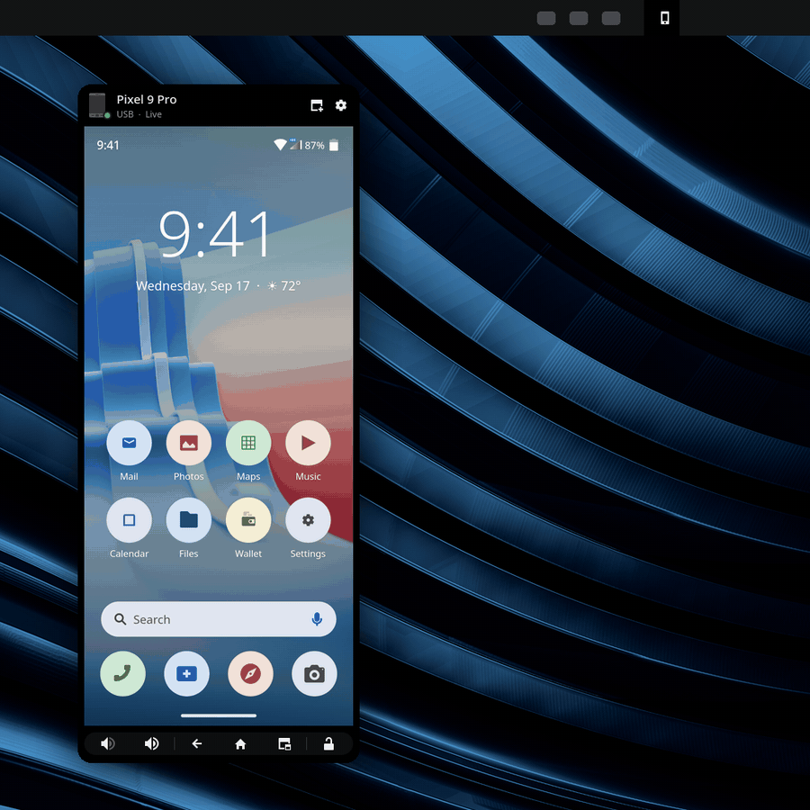
</p>

---

<a id="get-started"></a>

## 🚀 Get started

```sh
git clone --recurse-submodules https://github.com/DevL0rd/Android-Daemon.git
cd Android-Daemon
./install.sh
```

That's it. The installer grabs `adb`, `scrcpy`, `ffmpeg` and the virtual webcam driver, starts the background services and adds two Plasma widgets: **Phone Screen** for your desktop and **Phone Manager** for your system tray. Everything is installed into your home folder, so you're free to delete the cloned folder afterwards.

> [!TIP]
> Turn on **USB debugging** on your phone, plug it in and allow this computer when the phone asks. That one plug is all it needs: from then on the phone is found over USB or Wi-Fi on its own.

<table>
  <tr>
    <td>🔄 <b>Update</b></td>
    <td>On Arch-based systems Android-Daemon updates itself with every system update and lets you know when it has. Anywhere else, or any time you like, run <code>git pull && ./install.sh</code>; it's safe to repeat and keeps your settings.</td>
  </tr>
  <tr>
    <td>📦 <b>From a package</b></td>
    <td>Package builds run <code>./install.sh --aur</code>, so your package manager handles updates instead.</td>
  </tr>
  <tr>
    <td>🧹 <b>Remove</b></td>
    <td>Run <code>./uninstall.sh</code>. The services, widgets and webcam device go away and your system is left as it was. Your settings stay in <code>~/.config/Linux-Android-Daemon</code>. Packages like <code>adb</code> and <code>scrcpy</code> from your package manager stay installed, and so does the adb key your phones trust.</td>
  </tr>
  <tr>
    <td>🖥️ <b>Needs</b></td>
    <td>KDE Plasma 6 and an Android phone with USB debugging. The webcam needs Android 12 or newer.</td>
  </tr>
  <tr>
    <td>🐧 <b>Distros</b></td>
    <td>The installer sets everything up on Arch and Arch-based systems like CachyOS, Fedora, openSUSE Tumbleweed and Debian testing. Where your distro doesn't package <code>scrcpy</code>, it puts scrcpy's official build in your home folder. On Fedora the webcam driver comes from RPM Fusion.</td>
  </tr>
  <tr>
    <td>🧊 <b>Atomic desktops</b></td>
    <td>On Fedora Atomic desktops like Kinoite, Aurora and Bazzite, and on SteamOS in Desktop Mode, the installer leaves the read-only system untouched and puts <code>scrcpy</code> and <code>adb</code> in <code>~/.local</code>. If the system is missing something a feature needs, like the webcam driver, the installer tells you which features stay off and, on Fedora Atomic, what to add.</td>
  </tr>
</table>

<a id="wireless"></a>

### 🔌 Plug in once, then go wireless

<p align="center">
  <picture>
    <source media="(prefers-color-scheme: dark)" srcset="docs/media/connect-dark.svg">
    <source media="(prefers-color-scheme: light)" srcset="docs/media/connect-light.svg">
    
  </picture>
</p>

The first time a phone is plugged in it's added to your settings, its Wi-Fi address is saved and wireless debugging is switched on. Walk away with it and the mirror and webcam carry on over Wi-Fi; plug the cable back in and they hop onto the faster USB link. Wireless debugging stays on until the phone restarts.

<p align="right"><a href="#top">back to top ⬆</a></p>

---

<a id="see-it-work"></a>

## 🎬 See it work

### 📱 Phone Screen on your desktop

<table>
  <tr>
    <td width="40%" valign="top">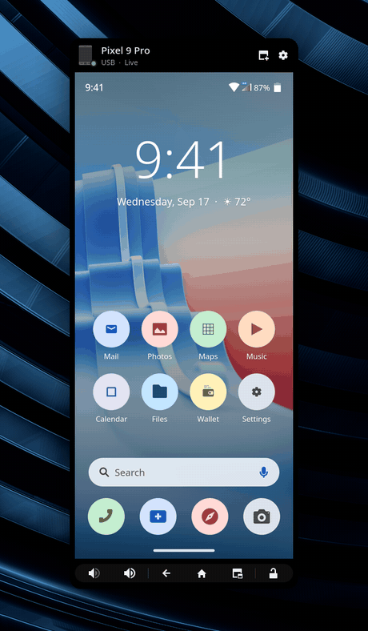</td>
    <td valign="top">
      <br>
      Add <b>Phone Screen</b> to your desktop and your phone lives there: the real screen, live, and you can click, scroll and type into it like any other window.
      <br><br>
      The header shows which phone it is and whether it's on USB or Wi-Fi. Underneath are volume, <b>Back</b>, <b>Home</b>, <b>Recent apps</b> and a lock button that always matches the phone, even when it locks itself on a timeout.
      <br><br>
      Lock the phone and the mirror hides; double-click to unlock it again. When a game or video goes fullscreen the mirror steps aside and comes back when you're done. If the phone is out of reach, the widget says so and reconnects the moment it's back.
      <br><br>
      Want it bigger? <b>Pop out</b> opens the phone in its own movable window.
    </td>
  </tr>
</table>

### 🗂️ Phone Manager in your tray

<table>
  <tr>
    <td valign="top">
      <br>
      <b>Phone Manager</b> puts the same phone one click away in your system tray, along with the webcam and every setting.
      <br><br>
      There's only ever one mirror. Open the tray popup and the phone moves into it, unlocking as it goes; close the popup and it slides straight back to your desktop widget without reconnecting.
      <br><br>
      Drag the handle at the bottom to make the phone bigger or smaller, and the popup remembers the size for that phone's screen. Pin it open to keep using the phone while you click around your desktop.
      <br><br>
      <table>
        <tr><td>📱 <b>Phone</b></td><td>The live mirror with volume, navigation and lock</td></tr>
        <tr><td>📷 <b>Webcam</b></td><td>A live camera preview and every capture option</td></tr>
        <tr><td>⚙️ <b>Settings</b></td><td>Your phones and everything about how they connect</td></tr>
      </table>
    </td>
    <td width="40%" valign="top">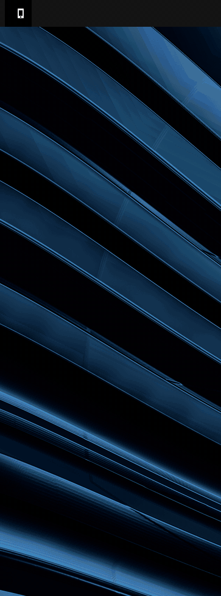</td>
  </tr>
</table>

#### 🔎 Search everything

Start typing in the popup to find any setting, phone or action. Press <kbd>Enter</kbd> to run the top result, so locking the phone or jumping to the webcam is a word away.

<p align="center">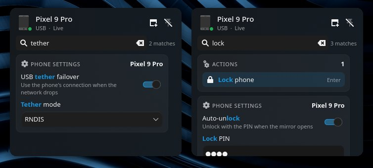</p>

<p align="right"><a href="#top">back to top ⬆</a></p>

---

<a id="webcam"></a>

## 📷 Your phone is a webcam

Your phone's camera shows up as **Phone Camera** in every app that uses a webcam: OBS, browsers, Discord and video calls. Nothing connects until something actually opens it, so the phone isn't kept awake for nothing.

<p align="center">
  <picture>
    <source media="(prefers-color-scheme: dark)" srcset="docs/media/webcam-flow-dark.svg">
    <source media="(prefers-color-scheme: light)" srcset="docs/media/webcam-flow-light.svg">
    
  </picture>
</p>

<table>
  <tr>
    <td width="33%" valign="top">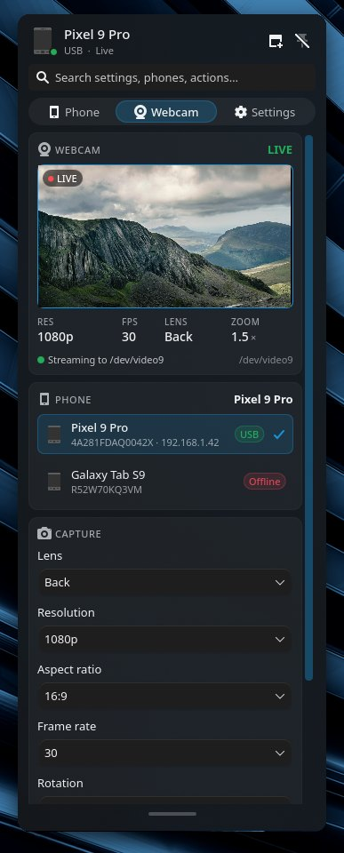<p align="center"><b>Live preview</b> — see the shot while you set it up</p></td>
    <td width="33%" valign="top">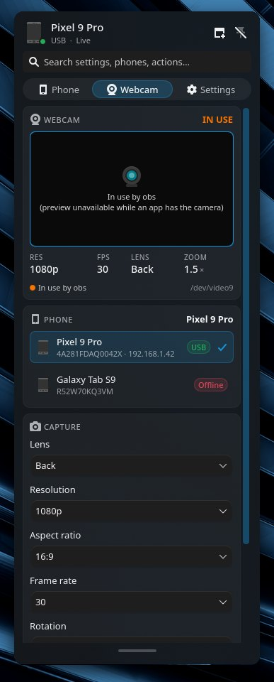<p align="center"><b>In use</b> — see which app has the camera</p></td>
    <td valign="top">
      <br>
      <b>Pick your shot</b>
      <br><br>
      📸 Back, front or external lens<br>
      🖼️ Up to 4K, in 16:9, 4:3, 3:2 or 1:1<br>
      🎞️ 60, 30, 24 or 15 frames a second<br>
      🔄 Landscape, portrait, upside-down or mirrored<br>
      🔍 Zoom<br>
      🔦 Torch<br>
      ⚡ High-speed capture
      <br><br>
      The feed follows the faster link, switching between USB and Wi-Fi as you plug and unplug.
    </td>
  </tr>
</table>

---

<a id="tether"></a>

## 🛟 Internet backup through your phone

<p align="center">
  <picture>
    <source media="(prefers-color-scheme: dark)" srcset="docs/media/tether-dark.svg">
    <source media="(prefers-color-scheme: light)" srcset="docs/media/tether-light.svg">
    
  </picture>
</p>

Turn on **USB tether failover** for a phone and your PC stays online through it. The moment your Wi-Fi or Ethernet goes away, the plugged-in phone starts USB tethering; when a real network comes back, tethering switches off again. Pick RNDIS or NCM to suit your phone.

---

### ✨ And the little things

<table>
  <tr>
    <td width="33%" valign="top">
      <h4>🔓 Unlocks for you</h4>
      Save your PIN and the phone unlocks itself when the mirror opens.
    </td>
    <td width="33%" valign="top">
      <h4>🌑 Screen stays dark</h4>
      The phone's own display switches off while you use it on your desktop.
    </td>
    <td width="33%" valign="top">
      <h4>🎮 Steps aside for games</h4>
      Fullscreen apps get the whole screen; the mirror comes back afterwards.
    </td>
  </tr>
  <tr>
    <td valign="top">
      <h4>📚 Every phone you own</h4>
      Each phone is remembered with its own settings. Pick which one to use, or ignore one entirely.
    </td>
    <td valign="top">
      <h4>🔔 Clickable notifications</h4>
      With KDE Connect, click a phone notification on your PC to open the mirror with the notification shade pulled down.
    </td>
    <td valign="top">
      <h4>🖥️ Extended display</h4>
      Give the phone a second screen of its own instead of mirroring the one in your hand. Samsung phones can open DeX there if you turn on <b>Samsung DeX on external</b>; it's off by default.
    </td>
  </tr>
  <tr>
    <td valign="top">
      <h4>🧭 Rotation that holds</h4>
      Keep the phone in portrait or landscape while it's mirrored, however you turn it.
    </td>
    <td valign="top">
      <h4>💬 Connect alerts</h4>
      Get a desktop notification when a phone plugs in and when wireless debugging is ready.
    </td>
    <td valign="top">
      <h4>💾 Survives a restart</h4>
      Each phone's Wi-Fi address is saved, so it's found again over Wi-Fi after your computer restarts.
    </td>
  </tr>
</table>

<p align="right"><a href="#top">back to top ⬆</a></p>

---

<a id="settings"></a>

## 🎛️ Settings

Everything lives on the **Settings** and **Webcam** tabs in Phone Manager and applies instantly. Each phone keeps its own settings, and you never need to edit a file.

<table>
  <tr>
    <td width="50%">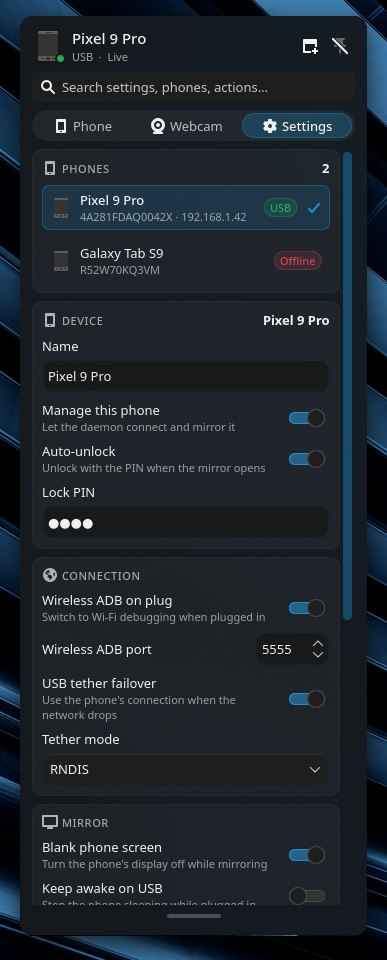<p align="center"><b>Phones, device and connection</b> — name, auto-unlock, wireless debugging and tether failover</p></td>
    <td width="50%">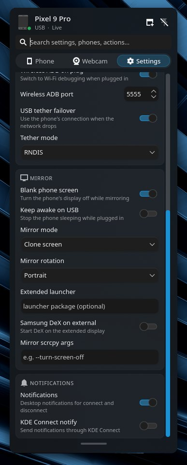<p align="center"><b>Mirror and notifications</b> — screen off, stay awake, clone or extended display, rotation, scrcpy options and alerts</p></td>
  </tr>
</table>

Right-click either widget and choose **Configure** for a few extras: which phone the desktop widget shows, whether it sits below other windows, a small position nudge for unusual scaling, extra scrcpy options for that widget and an accent colour.

---

<a id="how-it-works"></a>

## 🧠 How it fits together

<p align="center">
  <picture>
    <source media="(prefers-color-scheme: dark)" srcset="docs/media/architecture-dark.svg">
    <source media="(prefers-color-scheme: light)" srcset="docs/media/architecture-light.svg">
    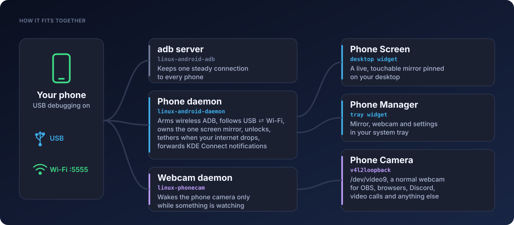
  </picture>
</p>

Three small user services do the work. The widgets never start `scrcpy` themselves: each one tells the phone daemon where it wants the phone to appear, and the daemon moves its one mirror window to whichever widget is showing. That's why the phone can jump between your desktop and the tray without reconnecting.

| Service | What it does |
| :-- | :-- |
| `linux-android-adb` | Runs the adb server every other part shares |
| `linux-android-daemon` | Wireless debugging, the mirror, auto-unlock, tether failover and KDE Connect notifications |
| `linux-phonecam` | The on-demand webcam feed |

Two command line tools come along for scripting: `phonescreenctl` (lock, unlock, volume, navigation, pop out) and `phonecamctl` (webcam settings and which phone to use).

---

<a id="configuration"></a>

## ⚙️ Configuration

Every setting from the Settings tab is saved in `~/.config/Linux-Android-Daemon/config.json`. It's created for you on install, kept when you uninstall, and picked up the moment you save a change. If an older install kept it in the repository folder, the installer moves it there for you. New phones are added automatically the first time they're plugged in, starting from `defaults`.

<details>
<summary><b>📱 Per-phone settings</b></summary>
<br>

| Key | Default | What it does |
| :-- | :-- | :-- |
| `name` | phone model | The name shown in the widgets and notifications |
| `enabled` | `true` | `false` ignores the phone completely |
| `enable_tcpip` | `true` | Switch on wireless debugging when the phone is plugged in |
| `tcpip_port` | `5555` | The wireless debugging port |
| `unlock` | `true` | Unlock the phone with `lock_pin` when the mirror opens |
| `lock_pin` | `""` | Your PIN; nothing is typed while it's empty |
| `screen_off` | `true` | Turn the phone's display off while it's mirrored |
| `stay_awake` | `false` | Keep the phone awake while it's plugged in |
| `mode` | `"clone"` | `"clone"` mirrors the screen, `"extended"` gives the phone a second display |
| `display_launcher` | `""` | An app to start on the extended display |
| `dex_desktop_mode` | `false` | Start Samsung DeX on the extended display. The phone's desktop mode setting is switched on while the mirror runs and put back when it closes |
| `orientation` | `"portrait"` | Hold the phone in `"portrait"` or `"landscape"` while mirrored, or `"auto"` |
| `scrcpy_args` | `[]` | Extra scrcpy options, added on top of the ones in `defaults` |
| `tether_failover` | `false` | Share the phone's connection over USB when your network drops |
| `tether_function` | `"rndis"` | `"rndis"` or `"ncm"` |
| `notify` | `false` | Desktop notifications when the phone connects |
| `kdeconnect_notify` | `false` | Clickable KDE Connect notifications (set in `defaults`) |
| `last_ip` | saved for you | The phone's Wi-Fi address, updated every time it's plugged in |

</details>

<details>
<summary><b>📷 Webcam settings</b></summary>
<br>

The webcam is shared by all phones, so its settings live in a separate `camera` block.

| Key | What it does |
| :-- | :-- |
| `active_serial` | Which phone to use; empty picks the plugged-in phone first, then one on Wi-Fi |
| `video_nr` | The `/dev/videoN` number of the Phone Camera device |
| `facing` | `"back"`, `"front"` or `"external"` |
| `camera_id` | A specific camera, overriding `facing` |
| `resolution` | A height like `"1080"`, or an exact `"1920x1080"` |
| `fps` | Frames per second |
| `aspect_ratio` | `"16:9"`, `"4:3"`, `"3:2"` or `"1:1"` |
| `rotation` | `"@0"`, `"@90"`, `"@180"`, `"@270"` or `"flip0"` for mirrored |
| `zoom` | Starting zoom |
| `torch` | Turn the torch on |
| `high_speed` | High-speed capture |
| `extra_args` | Extra scrcpy options for the camera |

</details>

> [!NOTE]
> Your PIN is stored as plain text in `config.json`, which only lives on your machine and only your account can read. Leave auto-unlock off on a computer other people can log into.

---

<a id="faq"></a>

## 💬 Questions

<details>
<summary><b>Does my phone need to be rooted?</b></summary>
<br>
No. Everything goes through Android's own USB debugging, the same way <a href="https://github.com/Genymobile/scrcpy">scrcpy</a> works.
</details>

<details>
<summary><b>It stopped connecting over Wi-Fi. Why?</b></summary>
<br>
Wireless debugging switches off when the phone restarts. Plug it in over USB once and it's back on. Your phone and PC also need to be on the same network.
</details>

<details>
<summary><b>Why does clicking the mirror close the tray popup?</b></summary>
<br>
The phone is its own window floating over the popup, and Plasma closes popups when you click somewhere else. Pin the popup open with the pin button and you can use the phone as long as you like.
</details>

<details>
<summary><b>Does the webcam drain my phone?</b></summary>
<br>
Only while it's in use. The camera connects when an app opens Phone Camera or you look at the preview, and lets go of the phone as soon as nothing is watching. The first frame takes a second or two to arrive.
</details>

<details>
<summary><b>Can I use more than one phone?</b></summary>
<br>
Yes. Every phone you plug in is remembered with its own settings. Choose the one to use from the list in Phone Manager, and point each desktop widget at a phone from its Configure dialog.
</details>

<details>
<summary><b>Where are the logs?</b></summary>
<br>
<code>journalctl --user -u linux-android-daemon -u linux-phonecam -f</code>
</details>

---

<a id="more"></a>

## 🧰 More from DevL0rd

Other Plasma projects made to sit on the same desktop. Click a banner to open it on GitHub.

<p align="center">
  <a href="https://github.com/DevL0rd/Konveyor">
    <picture>
      <source media="(prefers-color-scheme: dark)" srcset="docs/media/more/konveyor-dark.svg">
      <source media="(prefers-color-scheme: light)" srcset="docs/media/more/konveyor-light.svg">
      
    </picture>
  </a>
  <br>
  <a href="https://github.com/DevL0rd/Konveyor"><b>Konveyor</b></a> · Your windows, on a conveyor belt.
</p>

<p align="center">
  <a href="https://github.com/DevL0rd/RVC-Voice-Changer">
    <picture>
      <source media="(prefers-color-scheme: dark)" srcset="docs/media/more/rvc-voice-changer-dark.svg">
      <source media="(prefers-color-scheme: light)" srcset="docs/media/more/rvc-voice-changer-light.svg">
      
    </picture>
  </a>
  <br>
  <a href="https://github.com/DevL0rd/RVC-Voice-Changer"><b>RVC Voice Changer</b></a> · Sound like anyone, in every app.
</p>

<p align="center">
  <a href="https://github.com/DevL0rd/KBoard">
    <picture>
      <source media="(prefers-color-scheme: dark)" srcset="docs/media/more/kboard-dark.svg">
      <source media="(prefers-color-scheme: light)" srcset="docs/media/more/kboard-light.svg">
      
    </picture>
  </a>
  <br>
  <a href="https://github.com/DevL0rd/KBoard"><b>KBoard</b></a> · Type, glide and talk, right on your desktop.
</p>

<p align="center">
  <a href="https://github.com/DevL0rd/Syncthing-Monitor">
    <picture>
      <source media="(prefers-color-scheme: dark)" srcset="docs/media/more/syncthing-monitor-dark.svg">
      <source media="(prefers-color-scheme: light)" srcset="docs/media/more/syncthing-monitor-light.svg">
      
    </picture>
  </a>
  <br>
  <a href="https://github.com/DevL0rd/Syncthing-Monitor"><b>Syncthing Monitor</b></a> · Your sync, at a glance.
</p>

---

<p align="center">
  Released under the <a href="LICENSE">MIT License</a>. Built on <a href="https://github.com/Genymobile/scrcpy">scrcpy</a>. Android-Daemon is an independent project and is not affiliated with Google, Genymobile or KDE.
</p>

<p align="center"><a href="#top">back to top ⬆</a></p>
